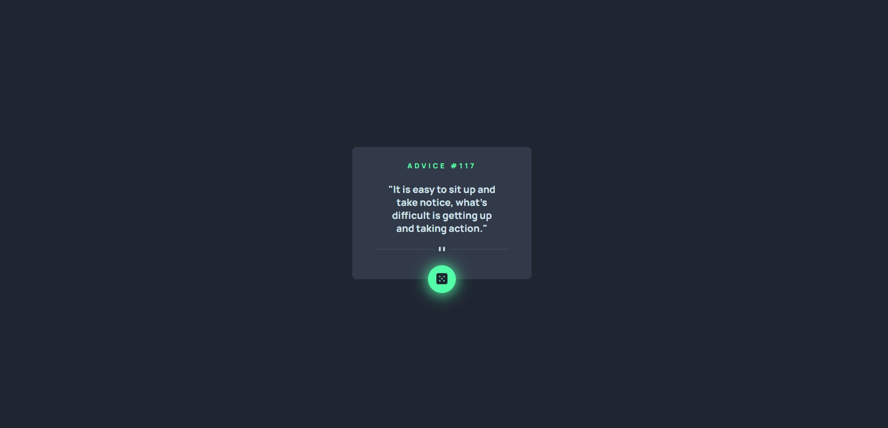

- [Overview](#overview)
  - [Screenshot](#screenshot)
- [My process](#my-process)
  - [Built with](#built-with)
  - [What I learned](#what-i-learned)
- [Author](#author)
- [Acknowledgments](#acknowledgments)

## Overview

A simple page to sort an advisor. In this first commit I built only the design and when I start learn JS I'll implement the sort button.

### Screenshot

## My process

First I looked the design and start think how to elaborate the HTML code, then I started to code it. When I finished it, I start to implement the CSS from top to bottom. The hover on the button was a really challenge for me, because at first I did not understood the box-shadow clearly. But at the end after a lot of research on MDN and W3s I finished it.

### Built with

- HTML5
- CSS custom properties
- Flexbox
- CSS Grid

### What I learned

With this project I learned how to use box-shadow properly and it was really nice to me.

### Continued development

My objetive is continue doing more challenges like this one to improve my CSS.

## Author

- Twitter - [@JooTercio](https://twitter.com/JooTercio)

## Acknowledgments

One month ago, if you asked me If I could creat a simple project like this one, I probaly gonna aswer you DONT, but with the courses I doing in DEVQUEST and ORIGAMID, I felling really happy with this whole process and motivated to build new Front End projects.
